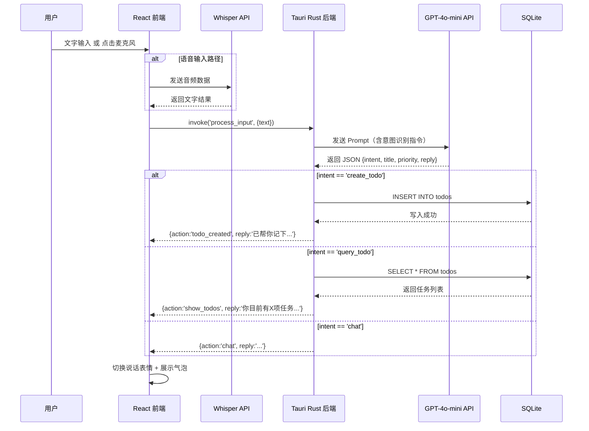
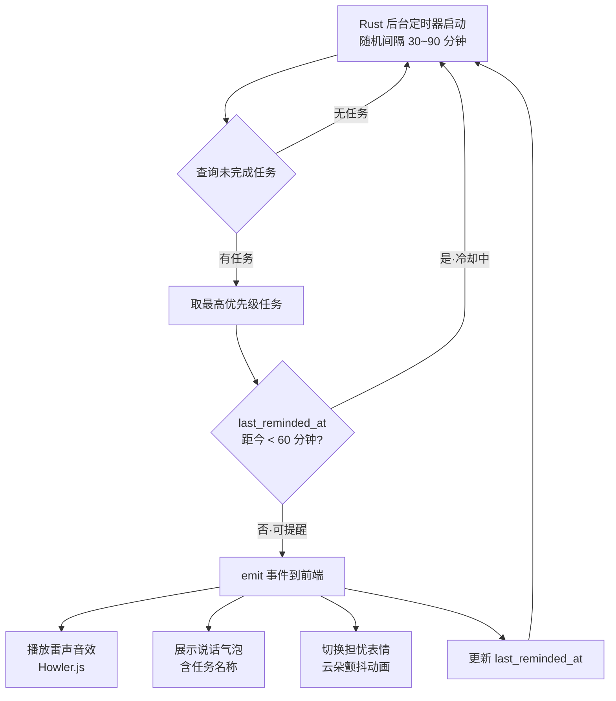
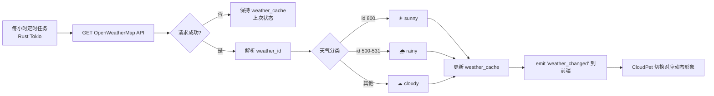

# 云朵桌面宠物助手 · 产品需求文档 (PRD)

> 版本：V1.0-MVP | 日期：2026-02-27 | 状态：已锁定

---

## 一、产品路线图 (Product Roadmap)

### 核心目标 (Mission)

打造一只始终陪伴在桌面的云朵伙伴，用温度与智能把日常琐事变得轻盈有趣。

---

### 用户画像 (Persona)

**用户：** 长期在电脑前工作/学习的独立个体（当前阶段：创作者本人）

**核心痛点：**
- 任务管理工具太"冷"，没有情绪连接，用不了几天就放弃
- 需要一个能理解自然语言、不需要学习操作逻辑的助手
- 桌面宠物类产品只有观赏性，没有实用价值
- 传统提醒工具打断感强，缺乏"友好提醒"的温度

---

### V1：最小可行产品 (MVP)

#### 云朵角色与界面
- [ ] 云朵形象渲染（始终置顶、无边框、透明背景窗口）
- [ ] 基础动态表情系统（默认 / 开心 / 困倦 / 说话 / 下雨 / 担忧，共 6 种状态）
- [ ] 悬停云朵 → 召出功能圆形菜单（待办、设置）
- [ ] 可拖拽移动，吸附屏幕边缘
- [ ] 低干扰模式：全屏应用激活时自动半透明化（透明度降至 20%）

#### 输入系统
- [ ] 透明底 + 白色单线细框输入框，常驻云朵正下方
- [ ] 文字输入 → 发送给 AI 模型处理
- [ ] 麦克风按钮（白色线条绘制）→ 语音转文字（Whisper API）→ 发送 AI 处理
- [ ] AI 返回结果后，云朵展示说话气泡

#### 待办工具
- [ ] AI 从对话中识别待办意图，自动创建任务并推断优先级
- [ ] 三级优先级：高（红）/ 中（黄）/ 低（绿）
- [ ] 待办列表窗口：任务清单、完成勾选、优先级色标、关闭按钮
- [ ] 完成任务 → 文字变灰并划线，方框打勾
- [ ] 支持优先级正序 / 倒序切换
- [ ] 随机间隔提醒（30~90 分钟）：云朵升起说话气泡，播放轻微雷声音效，提示当前最高优先级未完成任务

#### 天气联动（简化版）
- [ ] 接入天气 API，每小时更新一次
- [ ] 仅映射三种状态：晴天（顶着太阳）/ 雨天（变灰+雨滴动画）/ 多云（默认+淡灰色调）

#### 数据存储
- [ ] 所有数据本地存储（SQLite）

---

### V2 及以后版本 (Future Releases)

**V2 — 深度陪伴**
- [ ] 专注模式（番茄钟）：戴眼镜陪读状态，检测到切换社交软件时敲窗警告
- [ ] 进度可视化：饱食度 / 经验槽，完成任务越多宠物越活跃，并给出鼓励反馈
- [ ] 时间联动：深夜打哈欠、早晨打招呼等时段表情
- [ ] 云端数据同步（后端服务 + 账号体系）

**V3 — 跨端扩展**
- [ ] 手机 APP（iOS + Android），与云朵完整对话，数据云端同步
- [ ] 定时自动化任务引擎（定时抓取信息、自动发送邮件）
- [ ] 音乐节奏联动（检测系统音频，随节奏摇摆）

---

### 关键业务逻辑 (Business Rules)

1. **AI 意图识别优先级：** 每条用户输入先判断意图（创建待办 / 查询待办 / 闲聊），待办类优先写入本地数据库，再返回确认话术给用户
2. **优先级推断规则：** AI 根据用户描述的紧迫程度自动推断优先级；用户也可明确说"高优先级"覆盖 AI 推断
3. **提醒冷却机制：** 同一任务被提醒后，进入 60 分钟冷却期，避免重复打扰
4. **低干扰触发条件：** 检测到全屏窗口（游戏/视频/PPT演示）时自动透明化；鼠标悬停在宠物区域超过 1 秒才触发菜单，避免误触
5. **天气更新策略：** 每小时请求一次天气 API，失败则保持上次状态，不影响核心功能

---

### 数据契约 (Data Contract)

#### todos 表
```sql
id               TEXT PRIMARY KEY,   -- UUID
title            TEXT NOT NULL,       -- 任务内容
priority         TEXT NOT NULL,       -- 'high' | 'medium' | 'low'
is_completed     INTEGER DEFAULT 0,   -- 0=未完成 1=已完成
created_at       TEXT NOT NULL,       -- ISO8601 时间戳
completed_at     TEXT,               -- 完成时间，可为空
last_reminded_at TEXT                -- 上次提醒时间，用于冷却计算
```

#### settings 表
```sql
key   TEXT PRIMARY KEY,
value TEXT NOT NULL
-- 包含键：weather_api_key, ai_api_key,
--         sort_order('asc'|'desc'),
--         reminder_interval_min('30'~'90')
```

#### weather_cache 表
```sql
id         INTEGER PRIMARY KEY DEFAULT 1,
condition  TEXT NOT NULL,   -- 'sunny' | 'rainy' | 'cloudy'
updated_at TEXT NOT NULL,
raw_data   TEXT             -- JSON原始响应
```

---

## 二、选定原型图 · 概念 B（圆润治愈 · 输入框改为单线细框）

```
╔══════════════════════════════════════════════════════════════════════╗
║  概念 B  ·  圆润治愈  ·  关键词：饱满 · 可爱 · 温暖感               ║
╠══════════════════════════════════════════════════════════════════════╣
║                                                                      ║
║  【主界面·默认状态】            【悬停·召出圆形菜单】                 ║
║                                                                      ║
║   ✦        ✦    ✦              ✦        ✦    ✦                       ║
║      ╭─────────────╮              ╭─────────────╮                   ║
║   ╭──╯             ╰──╮        ╭──╯             ╰──╮                ║
║  ╭╯  ●         ●      ╰╮      ╭╯  ●         ●      ╰╮               ║
║  │        ω             │      │        ω             │              ║
║  ╰╮                  ╭─╯      ╰╮                  ╭─╯               ║
║    ╰──────────────────╯          ╰────────────────╯                  ║
║                                       ↙         ↘                   ║
║  ╭──────────────────────╮      ╭──────────╮ ╭──────────╮            ║
║  │  说点什么吧～      🎤 │      │  ☑ 待办  │ │  ⚙ 设置  │            ║
║  ╰──────────────────────╯      ╰──────────╯ ╰──────────╯            ║
║        ↑ 白色单线细框                                                 ║
║                                                                      ║
║  【提醒气泡·雷声触发】          【待办工具窗口】                       ║
║                                                                      ║
║  ★  ╭───────────────────────╮  ╭══ ✿ 今日待办 ✿ ════════ ✕ ╮        ║
║     │  嘿！「项目报告」       │  ║  🔴 ☐  完成项目报告          ║        ║
║     │  还没做完，加把劲！✨   │  ║  🟡 ☑  ~~回复邮件~~          ║        ║
║     ╰────────────╮───────────╯  ║  🟢 ☐  整理桌面              ║        ║
║      ⚡   ⚡      │              ╠══════════════════════════════╣        ║
║      ╭─────────────╮            ║  排序 [高→低 ↕]  完成 1/3   ║        ║
║   ╭──╯             ╰──╮         ╰══════════════════════════════╯        ║
║  ╭╯  ◑         ◑      ╰╮  ← 担忧/着急表情                             ║
║  │       ╭─────╮        │                                             ║
║  ╰╮      │ ~~~ │     ╭─╯                                             ║
║    ╰──────────────────╯                                               ║
║  ╭──────────────────────╮                                             ║
║  │                   🎤 │   ← 白色线条麦克风图标                      ║
║  ╰──────────────────────╯                                             ║
║                                                                      ║
║  【天气联动状态示意】                                                  ║
║                                                                      ║
║   晴天                多云                雨天                        ║
║   ☀                                       💧💧                       ║
║  ╭──────╮          ╭──────╮          ╭──────╮                        ║
║ ╭╯ ● ● ╰╮        ╭╯ ● ● ╰╮        ╭╯ ● ● ╰╮  ← 变灰色              ║
║ │   ω   │        │   -   │        │   ︵   │                        ║
║  ╰──────╯          ╰──────╯          ╰──────╯                        ║
║                                       💧💧💧                          ║
╚══════════════════════════════════════════════════════════════════════╝
```

---

## 三、设计说明

### 视觉规范

| 元素 | 规范 |
|------|------|
| 云朵主体 | 白色填充，圆润边缘，轻微阴影（box-shadow: 0 8px 32px rgba(255,255,255,0.3)）|
| 输入框 | 透明背景，白色单线细框（1px，opacity: 0.8），圆角 24px |
| 麦克风图标 | 白色线条绘制，SVG，无填充 |
| 悬停菜单按钮 | 半透明白色卡片，圆角 12px，hover 时轻微放大（scale 1.05）|
| 说话气泡 | 白色背景，圆角，带三角尾巴指向云朵，轻微投影 |
| 待办窗口 | 半透明毛玻璃效果（backdrop-filter: blur），圆角 16px |

### 表情状态对应表

| 状态触发条件 | 表情 | 动作描述 |
|------------|------|---------|
| 默认 / 空闲 | 默认 ω | 轻微上下漂浮动画 |
| AI 回复中 | 说话 | 嘴巴小幅开合动画 |
| 任务完成 | 开心 ◡ | 短暂跳跃 + 星星特效 |
| 提醒触发 | 担忧 ╮_╭ | 云朵微微颤抖 |
| 雨天天气 | 难过 ︵ | 整体变灰，雨滴下落 |
| 深夜（V2）| 困倦 | 打哈欠，眼睛半闭 |

---

## 四、架构设计蓝图

### 4.1 技术选型

| 层级 | 技术选型 | 选型理由 |
|------|---------|---------|
| 桌面框架 | **Tauri 2.x** | Rust 内核，包体小（<10MB），性能好，原生系统 API 访问 |
| 前端框架 | **React 18 + TypeScript** | 组件化适合表情/动画管理，生态成熟 |
| 动画引擎 | **CSS Animation + Framer Motion** | 云朵漂浮、表情切换的流畅动画 |
| AI 接口 | **DeepSeek-V3 API** | 意图识别 + 自然语言对话，成本极低，API 与 OpenAI 格式兼容，后期可平滑切换 |
| 语音识别 | **Whisper API** | 准确率高，支持中文 |
| 天气服务 | **OpenWeatherMap API** | 免费额度足够个人使用 |
| 本地数据库 | **SQLite（tauri-plugin-sql）** | 轻量，零配置，Tauri 官方插件支持 |
| 状态管理 | **Zustand** | 轻量，适合中小型应用 |
| 音效 | **Howler.js** | 轻量音频库，支持雷声等音效播放 |

### 4.2 项目目录结构

```
zhushou/
├── src/                          # 前端 React 源码
│   ├── components/
│   │   ├── CloudPet/             # 云朵角色核心组件
│   │   │   ├── index.tsx         # 渲染逻辑
│   │   │   ├── expressions.ts    # 表情状态枚举与配置
│   │   │   └── animations.css    # 漂浮/跳跃/颤抖动画
│   │   ├── InputBar/             # 输入框 + 麦克风按钮
│   │   ├── HoverMenu/            # 悬停召出的圆形菜单
│   │   ├── TodoPanel/            # 待办清单浮窗
│   │   └── SpeechBubble/         # 说话气泡
│   ├── services/
│   │   ├── ai.ts                 # AI API 调用与意图解析
│   │   ├── speech.ts             # Whisper 语音转文字
│   │   ├── weather.ts            # 天气 API 调用
│   │   ├── todo.ts               # 待办 CRUD（调用 Tauri commands）
│   │   └── reminder.ts           # 前端提醒触发逻辑
│   ├── store/
│   │   └── index.ts              # Zustand 全局状态
│   └── App.tsx
├── src-tauri/                    # Rust 后端源码
│   ├── src/
│   │   ├── main.rs
│   │   ├── commands/
│   │   │   ├── todo.rs           # 待办数据库 CRUD commands
│   │   │   ├── weather.rs        # 天气定时拉取任务
│   │   │   └── reminder.rs       # 后台提醒定时器
│   │   └── db/
│   │       └── schema.rs         # SQLite 建表与迁移
│   └── tauri.conf.json           # 窗口透明、置顶等配置
├── assets/
│   └── sounds/
│       └── thunder.mp3           # 提醒音效
└── Prd.md
```

### 4.3 核心流程图

#### 流程一：用户输入 → AI 处理 → 执行动作



#### 流程二：后台提醒服务



#### 流程三：天气联动



### 4.4 组件交互说明

| 事件来源 | 触发方 | 接收方 | 说明 |
|---------|--------|--------|------|
| 用户输入（文字/语音） | InputBar | AIService → Rust | 发起意图识别请求 |
| AI 返回创建待办 | Rust Command | TodoPanel + SpeechBubble | 刷新列表 + 展示气泡 |
| 鼠标悬停云朵 | CloudPet | HoverMenu | 延迟 1s 后显示菜单 |
| 全屏窗口检测 | Rust（系统 API） | CloudPet | 触发低干扰透明化 |
| 定时提醒触发 | Rust ReminderService | CloudPet + SpeechBubble + Howler | 联动三端响应 |
| 天气数据更新 | Rust WeatherService | CloudPet | 切换形象与动画状态 |
| 任务完成勾选 | TodoPanel | CloudPet | 切换开心表情 + 跳跃动画 |

### 4.5 技术风险预判

| 风险点 | 等级 | 说明 | 应对策略 |
|--------|------|------|---------|
| Tauri 窗口透明兼容性 | 高 | 不同 Windows 版本（Win10/11）透明渲染表现不一致 | 使用 `decorations: false` + `transparent: true`，提前在多版本 Win 上测试 |
| 全屏检测误判 | 中 | 部分应用不走标准全屏 API，导致低干扰模式失效 | 使用轮询检测前景窗口尺寸与屏幕分辨率对比，设置容差值 |
| Whisper API 延迟 | 中 | 网络差时语音识别响应慢，用户体验卡顿 | 录音完成立即显示"识别中..."动画，设置 5s 超时后提示重试 |
| AI API 成本 | 低 | 个人使用频率可控，DeepSeek-V3 费用极低 | 本地缓存高频对话模式，后期可切换 GPT-4o 或本地模型（Ollama） |
| SQLite 并发写入 | 低 | 提醒定时器与用户操作同时写入 | Rust 端使用 `Mutex<Connection>` 确保串行写入 |

---

*文档状态：已锁定 · 可开始开发*
